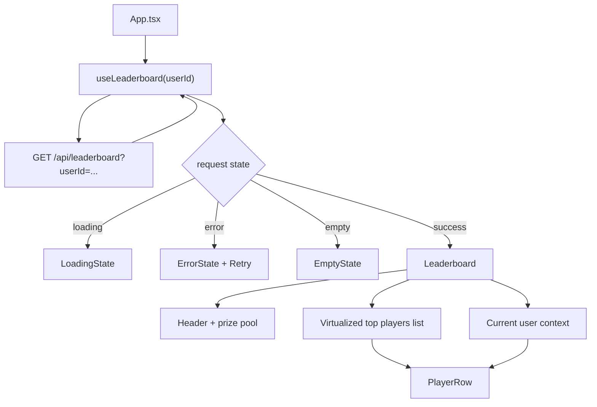

# Panteon Leaderboard Frontend

React, TypeScript and Vite based leaderboard UI for the full stack case.

## Frontend Flow



## Component Notes

- `App.tsx` owns the selected user and passes request state into the leaderboard.
- `App.tsx` keeps the UI read-only: leaderboard, recent Mongo events and finalized PostgreSQL weeks.
- `useLeaderboard` keeps API loading, success, empty and error states isolated from UI rendering.
- `Leaderboard` is prop-driven and renders only the view model it receives.
- `PlayerRow` is shared by the top list and current user context to keep row styling consistent.
- `react-window` is isolated inside the leaderboard list. The API normally returns the top 100, but virtualization keeps the component ready for larger result windows without growing DOM cost.

## API Shape Expected By The UI

```ts
type LeaderboardView = {
  topPlayers: PlayerRank[];
  currentUserContext: {
    self: PlayerRank;
    above: PlayerRank[];
    below: PlayerRank[];
  } | null;
};
```

The frontend expects a bounded response. It should not receive the full player ranking dataset.

## Scripts

```bash
npm install
npm run dev
npm run build
npm run lint
```

Set `VITE_API_BASE_URL` when the API is not running at `http://localhost:3000/api`.
